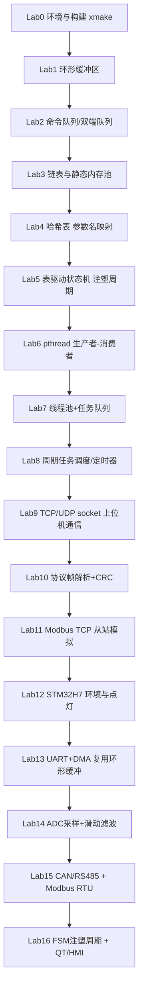

# Industrial C Labs 路线图（教学大纲）

主题贯穿：**注塑机控制系统**。每一关都遵循 `读指导书 → 实现 API → 跑通测试 → 解锁下一关` 的闭环，前面写的数据结构会在后面的并发 / 网络 / 嵌入式实验里被反复复用。

两个总目标：

1. **Linux 环境下 C 开发能力**（Track A / B / C）
2. **嵌入式开发能力**（Track D，基于 STM32H7 开发板，后期解锁）

---

## 全景图

---

## Track A：Linux C 与数据结构

| Lab | 主题 | 工业映射 | 关键复用 |
| --- | --- | --- | --- |
| 1 | 环形缓冲区 Ring Buffer | 串口/ADC/日志缓冲 | 被 L6、L13 复用 |
| 2 | 命令队列 / 双端队列 | HMI/上位机指令排队 | 被 L7、L11 复用 |
| 3 | 链表 + 静态内存池 | 动态报警链表、对象池（不 malloc） | 被 L10 复用 |
| 4 | 哈希表 | 参数名 → 寄存器地址映射 | 被 L11、L16 复用 |
| 5 | 表驱动有限状态机 FSM | 注塑周期：合模→射胶→保压→储料→冷却→开模→顶出 | 被 L16 复用 |

## Track B：并发与系统编程

| Lab | 主题 | 工业映射 | 关键复用 |
| --- | --- | --- | --- |
| 6 | pthread + 互斥/条件变量 | 采集线程 → 处理线程（生产者-消费者） | 复用 L1 |
| 7 | 线程池 + 任务队列 | 后台任务（记录/上报/告警分发） | 复用 L2 |
| 8 | 周期任务调度 / 定时器 | 控制周期 tick、超时管理 | 复用 L2 |

## Track C：网络通信与工业协议

| Lab | 主题 | 工业映射 | 关键复用 |
| --- | --- | --- | --- |
| 9 | TCP/UDP socket | 与上位机/MES 通信 | — |
| 10 | 协议帧解析 + CRC | 帧同步、校验、用状态机解析字节流 | 复用 L1、L5 |
| 11 | Modbus TCP 从站模拟 | 注塑机寄存器映射、标准工业协议 | 复用 L2、L4 |

## Track D：STM32H7 嵌入式（后期解锁）

> 开发板：正点原子 STM32-V7（STM32H743）。资源含 UART / CAN / RS485 / ADC-DAC / SDRAM / 显示屏 等。
> 进入本 Track 前会先单独给出工具链与环境搭建指引（arm-none-eabi-gcc / CubeMX / 烧录调试）。

| Lab | 主题 | 工业映射 | 关键复用 |
| --- | --- | --- | --- |
| 12 | 环境搭建 + 点灯 | 交叉编译、烧录、调试闭环跑通 | — |
| 13 | UART + DMA 接收 | 串口空闲中断 + DMA 收数据 | **直接复用 L1 环形缓冲** |
| 14 | ADC 采样 + 滑动滤波 | 压力/温度采样去噪 | 复用 L1 思想 |
| 15 | CAN / RS485 + Modbus RTU | 与温控/伺服模块现场总线通信 | 复用 L4、L10 |
| 16 | FSM 注塑周期 + QT/HMI | 完整注塑流程状态机 + 显示屏人机界面 | 复用 L5、L4 |

---

## 进度追踪

- [ ] [Lab 1 环形缓冲区](lab01_ring_buffer.md) ← **当前**
- [ ] [Lab 2 命令队列 / 双端队列](lab02_command_queue.md)
- [ ] [Lab 3 链表 + 静态内存池](lab03_linked_list_pool.md)
- [ ] [Lab 4 哈希表](lab04_hash_table.md)
- [ ] [Lab 5 表驱动状态机](lab05_fsm.md)
- [ ] [Lab 6 pthread 生产者-消费者](lab06_producer_consumer.md)
- [ ] [Lab 7 线程池 + 任务队列](lab07_thread_pool.md)
- [ ] [Lab 8 周期任务调度](lab08_scheduler.md)
- [ ] [Lab 9 TCP/UDP socket](lab09_socket_comm.md)
- [ ] [Lab 10 协议帧解析 + CRC](lab10_frame_parser.md)
- [ ] [Lab 11 Modbus TCP 从站](lab11_modbus_tcp.md)
- [ ] Lab 12 STM32H7 环境 + 点灯（待解锁）
- [ ] Lab 13 UART + DMA（待解锁）
- [ ] Lab 14 ADC + 滤波（待解锁）
- [ ] Lab 15 CAN/RS485 + Modbus RTU（待解锁）
- [ ] Lab 16 FSM + QT/HMI（待解锁）

> 说明：Track A/B/C（Lab 1~11）的脚手架与指导书均已就绪，每关可用 `xmake labN` / `xmake labN test` 独立构建与测试。Track D（STM32H7，Lab 12~16）会在搭好交叉编译工具链后单独给出。路线图可按你入职后了解到的真实技术栈随时调整。
