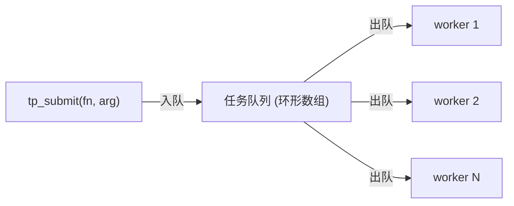

# Lab 7：线程池 + 任务队列

> 所属阶段：Track B - 并发与系统编程
> 预计用时：5~7 小时
> 前置：完成 Lab 2（队列）与 Lab 6（互斥锁 + 条件变量）

---

## 1. 工业背景：后台杂活交给线程池

注塑机控制器在跑实时控制循环的同时，还有一堆"后台杂活"：

- 把生产数据写入日志文件；
- 周期性上报 MES / 云平台；
- 分发告警（短信、声光、看板）；
- 生成趋势图、统计报表。

这些活儿耗时不定，绝不能阻塞实时控制循环。如果"每来一件就 `pthread_create` 一个线程"，线程数会失控、频繁创建销毁开销大，系统很快被拖垮。

工业界标准答案是**线程池**：上电时预先开好固定数量的工作线程，所有任务先丢进一个**任务队列**，空闲线程从队列里取任务执行。优点：

- 线程数量可控（不会被突发任务压垮）；
- 线程复用，省去反复创建/销毁的开销；
- 任务排队，自然削峰；队列满时还能产生**背压**（让提交方等一等）。

本关把 Lab 2 的队列 + Lab 6 的"加锁阻塞队列"组合起来，实现一个最小但完整的线程池。

---

## 2. 学习目标

完成本关后，你应该能：

1. 实现"固定工作线程 + 共享任务队列"的线程池模型；
2. 用条件变量实现"队列空则工作线程等、队列满则提交方等"；
3. 用函数指针 `tp_task_fn` 把"任务"抽象成可排队的数据；
4. 实现**优雅关闭**：跑完队列里已有任务，再 join 所有线程；
5. 理解"执行任务时绝不能持锁"这一关键约束。

---

## 3. 核心原理



工作线程主循环：

```c
static void *worker_main(void *arg) {
    thread_pool_t *tp = arg;
    for (;;) {
        pthread_mutex_lock(&tp->lock);
        while (tp->qcount == 0 && !tp->shutdown)
            pthread_cond_wait(&tp->not_empty, &tp->lock);
        if (tp->qcount == 0 && tp->shutdown) {     /* 队空且要关闭：退出 */
            pthread_mutex_unlock(&tp->lock);
            return NULL;
        }
        tp_task_t task = tp->queue[tp->qhead];     /* 取队首任务 */
        tp->qhead = (tp->qhead + 1) % tp->qcap;
        tp->qcount--;
        pthread_cond_signal(&tp->not_full);        /* 唤醒可能在等空位的提交方 */
        pthread_mutex_unlock(&tp->lock);

        task.fn(task.arg);                         /* 关键：执行任务时不持锁！ */
    }
}
```

**为什么执行任务时不能持锁？** 任务可能很慢（写文件、发网络）。如果持锁执行，其他工作线程和提交方全被卡住，线程池就退化成"单线程串行"，失去意义。

`tp_shutdown` 的优雅关闭：置 `shutdown=true` → `broadcast` 唤醒所有等待者 → 工作线程把队列剩余任务跑完后自然退出 → 主线程 `join` 每个工作线程 → 销毁锁。

---

## 4. 你要实现什么

文件位置：

- 头文件（**只读**）：[labs/lab07_thread_pool/include/thread_pool.h](../labs/lab07_thread_pool/include/thread_pool.h)
- 你要实现的源文件：[labs/lab07_thread_pool/src/thread_pool.c](../labs/lab07_thread_pool/src/thread_pool.c)
- 测试（**不要改**）：[labs/lab07_thread_pool/test/test_thread_pool.c](../labs/lab07_thread_pool/test/test_thread_pool.c)

需要实现的 API：

```c
tp_status_t tp_init(thread_pool_t *tp, pthread_t *worker_storage, size_t nworkers,
                    tp_task_t *queue_storage, size_t qcap);
tp_status_t tp_submit(thread_pool_t *tp, tp_task_fn fn, void *arg);     /* 满则阻塞 */
tp_status_t tp_try_submit(thread_pool_t *tp, tp_task_fn fn, void *arg); /* 满则返回 TP_ERR_FULL */
void        tp_shutdown(thread_pool_t *tp);
size_t      tp_pending(thread_pool_t *tp);
size_t      tp_worker_count(const thread_pool_t *tp);
size_t      tp_capacity(const thread_pool_t *tp);
```

你需要自己写一个 `static void *worker_main(void *arg)` 作为线程入口。

**约束**：

1. 工作线程数组、任务队列存储区都由调用者提供（不 malloc 这两块）；
2. 队列满时 `tp_submit` 阻塞（背压），不丢任务；
3. 工作线程执行任务时**不得持锁**；
4. `tp_shutdown` 必须把已入队任务跑完再退出，且 join 所有线程；
5. 关闭后 `tp_submit` / `tp_try_submit` 返回 `TP_ERR_SHUTDOWN`（在加锁前就用 `tp->shutdown` 挡掉，避免操作已销毁的锁）；
6. `tp_try_submit` 队列满时**立即返回 `TP_ERR_FULL`**，不阻塞。

测试会提交多达 5000 个任务、队列却只有 8 格，以此逼出 submit 阻塞，并校验"任务一个不少、一个不多"地全部执行；另有用"闸门任务"占住唯一 worker、填满队列后验证 `tp_try_submit` 返回 `TP_ERR_FULL` 的用例。

---

## 5. 推荐实现步骤

1. 写 `worker_main` 主循环（先不管 submit 阻塞）。
2. 写 `tp_init`（init 锁/cond，然后 `pthread_create` 启动各工作线程）。
3. 写 `tp_submit`（含满时阻塞）。
4. 写 `tp_shutdown`（broadcast + join + destroy）。
5. 跑 `test_run_few`，再跑 `test_many_with_backpressure`。

---

## 6. 构建与测试

```bash
xmake lab7          # 编译
xmake lab7 test     # 编译并运行测试
```

直接看明细：

```bash
xmake run test_lab07_thread_pool
```

全部实现后应看到 `==== summary: 6 run, 0 failed ====`。

> 若计数对不上：多半是某条出队/入队路径漏了 `signal`，或工作线程退出条件写错导致提前退出、漏跑任务。

---

## 7. 思考题

1. 工作线程退出条件为什么是 `qcount==0 && shutdown`，而不是只看 `shutdown`？只看 shutdown 会漏掉什么？
2. 测试里多个任务对同一个计数器 `+1`，任务函数内部为什么还要再加一把锁？线程池本身的锁不够吗？
3. 如果某个任务函数自己又调用 `tp_submit`（任务派生任务），可能出什么问题？如何避免死锁？
4. 现在 `submit` 满时会阻塞。换成"满了就丢弃并返回错误"在什么场景下更合适？注塑机告警分发更适合哪种？

---

## 8. 过关标准

- `xmake lab7 test` 通过（`0 failed`），测试在数秒内结束（不卡死）；
- 工作线程执行任务时不持锁；
- 关闭流程不丢任务、不泄漏线程（join 完整）；
- 编译无 `-Wall -Wextra` 告警。

完成后告诉我，我会解锁 **Lab 8：周期任务调度 / 定时器**。
