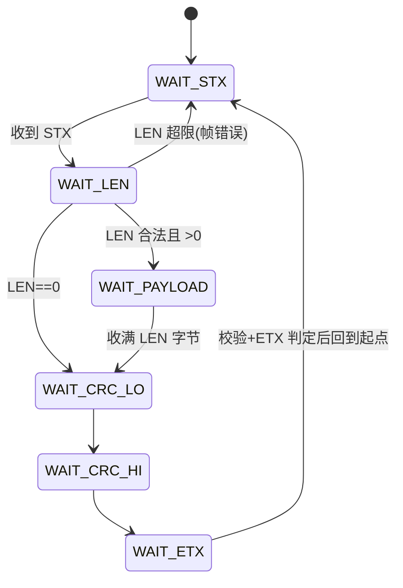

# Lab 10：协议帧解析 + CRC16

> 所属阶段：Track C - 网络通信与工业协议
> 预计用时：4~6 小时
> 前置：完成 Lab 1（缓冲）、Lab 5（状态机）、Lab 9（收发字节流）

---

## 1. 工业背景：字节流里怎么切出"一帧"

串口和 TCP 都是**字节流**，没有天然的消息边界。当上位机连续发两条命令时，接收端可能：

- **分包**：一条命令被拆成几次 `recv` 才收齐；
- **粘包**：两条命令在一次 `recv` 里一起到达；
- **误码**：线路干扰导致某个字节变了（尤其是 RS485 工业现场）。

所以每个工业协议都要自己定义**帧格式**并做三件事：**帧同步**（靠起始符找到帧头）、**按长度收齐**、**CRC 校验**（确认没传错）。

本关定义一个简单但完整的帧：

```
+-----+-----+------------------+--------+--------+-----+
| STX | LEN |   PAYLOAD(LEN)   | CRC_LO | CRC_HI | ETX |
| 0x02| 1B  |    LEN 字节      |  CRC16 低/高字节 | 0x03|
+-----+-----+------------------+--------+--------+-----+
```

- `CRC16` 对 **PAYLOAD 这 LEN 个字节**做 CRC-16/MODBUS，小端存放。
- 解析器用**字节流状态机**（正是 Lab 5 的思想）逐字节推进，无论怎么分包/粘包都能稳定切帧。

这套帧解析直接为 Lab 11（Modbus）和 Lab 15（Modbus RTU over RS485）打基础。

---

## 2. 学习目标

完成本关后，你应该能：

1. 实现 CRC-16/MODBUS（查表前的逐位算法）并理解校验的意义；
2. 用状态机做字节流的帧同步，正确应对分包 / 粘包 / 前导垃圾；
3. 区分并统计三类结果：成功帧、CRC 错误、帧格式错误；
4. 实现"打包（build）"与"解包（parse）"这对互逆操作。

---

## 3. 核心原理

**CRC-16/MODBUS**（初值 0xFFFF，反射多项式 0xA001）：

```c
uint16_t crc = 0xFFFF;
for (size_t i = 0; i < len; i++) {
    crc ^= data[i];
    for (int b = 0; b < 8; b++)
        crc = (crc & 1) ? (crc >> 1) ^ 0xA001 : (crc >> 1);
}
return crc;
```

**字节流状态机**（每来一个字节走一步）：



到 `WAIT_ETX` 时：若该字节是 ETX 且 `crc16_modbus(payload, len) == crc_rx`，就是一帧好数据，回调交付；CRC 不符记 `crc_errors`；ETX 不符记 `frame_errors`。无论哪种，处理完都回到 `WAIT_STX` 继续找下一帧——这保证了**坏帧不会卡死解析器**。

---

## 4. 你要实现什么

文件位置：

- 头文件（**只读**）：[labs/lab10_frame_parser/include/frame_parser.h](../labs/lab10_frame_parser/include/frame_parser.h)
- 你要实现的源文件：[labs/lab10_frame_parser/src/frame_parser.c](../labs/lab10_frame_parser/src/frame_parser.c)
- 测试（**不要改**）：[labs/lab10_frame_parser/test/test_frame_parser.c](../labs/lab10_frame_parser/test/test_frame_parser.c)

需要实现的 API：

```c
uint16_t   crc16_modbus(const uint8_t *data, size_t len);
int        fp_init(frame_parser_t *fp, fp_frame_cb cb, void *ctx);
void       fp_reset(frame_parser_t *fp);
fp_state_t fp_state(const frame_parser_t *fp);   /* 当前状态机所处状态 */
size_t     fp_feed(frame_parser_t *fp, const uint8_t *data, size_t len);
uint32_t   fp_good_count(const frame_parser_t *fp);
uint32_t   fp_crc_error_count(const frame_parser_t *fp);
uint32_t   fp_frame_error_count(const frame_parser_t *fp);
int        fp_build(uint8_t *out, size_t out_cap, const uint8_t *payload, uint8_t len);
```

**约束**：

1. 解析器逐字节驱动，必须正确处理分包 / 粘包 / 前导垃圾；
2. 坏帧（CRC 错、LEN 超限、ETX 不符）只计数、不交付，且不能卡死，要能继续解析后续帧；
3. `fp_build` 与解析互逆：build 出来的帧喂给 feed 必须能解析出来（含满负载 `FP_MAX_PAYLOAD` 与零负载帧）；
4. `fp_state` 返回当前状态机位置（初始 / 复位后为 `FP_WAIT_STX`）；
5. 对 NULL 参数安全。

---

## 5. 推荐实现步骤

1. 先写 `crc16_modbus`，用已知向量 `"123456789" -> 0x4B37` 自检。
2. 写 `fp_build`（打包），它也是测试用来造数据的工具。
3. 写 `fp_init` / 计数器读取函数。
4. 写 `fp_feed` 状态机（先跑通"整帧喂入"，再跑"逐字节""粘包"），最后处理坏 CRC / 坏 LEN。

---

## 6. 构建与测试

```bash
xmake lab10          # 编译
xmake lab10 test     # 编译并运行测试
```

直接看明细：

```bash
xmake run test_lab10_frame_parser
```

全部实现后应看到 `==== summary: 12 run, 0 failed ====`。

---

## 7. 思考题

1. 为什么 CRC 比"简单求和校验（checksum）"更能发现错误？它对哪类错误特别有效？
2. 如果负载里恰好出现了 STX(0x02) 或 ETX(0x03) 字节会怎样？本帧格式靠什么避免误判？（提示：本设计靠"先读 LEN 再按长度收"，所以负载里出现定界符也无妨——想想为什么）
3. 工业上还有一种"转义/字节填充（byte stuffing）"方案处理定界符冲突，它和"带长度字段"方案各有什么取舍？
4. 真实产品里 CRC 通常用查表法（256 项表）加速。逐位算法和查表法在嵌入式上如何权衡（速度 vs Flash 占用）？

---

## 8. 过关标准

- `xmake lab10 test` 通过（`0 failed`）；
- 分包 / 粘包 / 坏帧场景都正确；
- 编译无 `-Wall -Wextra` 告警。

完成后告诉我，我会解锁 **Lab 11：Modbus TCP 从站模拟**。
